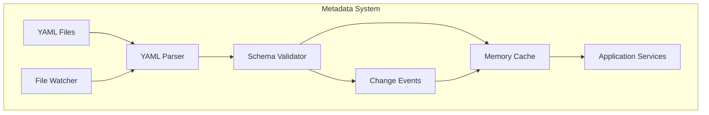

# 🎨 CREATIVE PHASE: METADATA SYSTEM DESIGN

## PROBLEM STATEMENT
Cần một hệ thống metadata linh hoạt để quản lý cấu hình cho:
- Authentication flows
- API routes và validation
- Database connections và schemas
- Middleware configurations

## OPTIONS ANALYSIS

### Option 1: File-based YAML Configuration
**Mô tả**: Sử dụng các file YAML riêng biệt cho từng loại cấu hình
**Ưu điểm**:
- Dễ đọc và chỉnh sửa
- Phân tách rõ ràng giữa các loại cấu hình
- Hỗ trợ version control tốt
**Nhược điểm**:
- Khó validate dependencies giữa các file
- Cần cơ chế merge configuration
- Không có UI quản lý
**Độ phức tạp**: Thấp
**Thời gian triển khai**: 1-2 sprints

### Option 2: Database-driven Configuration
**Mô tả**: Lưu metadata trong MongoDB với UI quản lý
**Ưu điểm**:
- CRUD operations dễ dàng
- Validation tập trung
- UI quản lý thuận tiện
**Nhược điểm**:
- Phụ thuộc vào database
- Khó version control
- Overhead khi startup
**Độ phức tạp**: Cao
**Thời gian triển khai**: 3-4 sprints

### Option 3: Hybrid Approach
**Mô tả**: YAML files + MongoDB cache + UI editor
**Ưu điểm**:
- Kết hợp ưu điểm của cả hai approach
- Linh hoạt trong deployment
- Hỗ trợ cả file-based và UI-based management
**Nhược điểm**:
- Phức tạp trong implementation
- Cần đồng bộ giữa file và database
- Setup initial khó khăn hơn
**Độ phức tạp**: Cao
**Thời gian triển khai**: 4-5 sprints

## DECISION
Chọn Option 1: File-based YAML Configuration

**Lý do**:
1. Phù hợp với giai đoạn hiện tại của dự án
2. Dễ implement và maintain
3. Tốt cho version control
4. Có thể mở rộng thêm UI trong tương lai

## IMPLEMENTATION PLAN

### 1. Cấu trúc thư mục
```
metadata/
├── auth/
│   ├── flows/
│   │   ├── login.yaml
│   │   ├── register.yaml
│   │   └── reset-password.yaml
│   └── policies/
│       ├── roles.yaml
│       └── permissions.yaml
├── api/
│   ├── routes/
│   │   ├── user.yaml
│   │   └── admin.yaml
│   └── validation/
│       ├── schemas/
│       └── rules/
└── db/
    ├── connections/
    │   └── mongodb.yaml
    └── schemas/
        └── collections/
```

### 2. Schema Definitions

#### Auth Flow Schema
```yaml
flow:
  name: string
  type: enum(login|register|reset)
  steps:
    - name: string
      handler: string
      validation:
        schema: string
      next:
        success: string
        failure: string
  validation:
    schema: string
```

#### API Route Schema
```yaml
route:
  path: string
  method: enum(GET|POST|PUT|DELETE)
  handler: string
  middleware:
    - name: string
      config: object
  validation:
    schema: string
```

#### Database Config Schema
```yaml
database:
  name: string
  type: enum(mongodb)
  connection:
    uri: string
    options: object
  collections:
    - name: string
      indexes:
        - fields: object
          options: object
```

### 3. Implementation Steps
1. Setup cấu trúc thư mục metadata
2. Implement YAML parser với validation
3. Tạo schema validators
4. Setup hot reload system
5. Tích hợp với dependency injection
6. Viết unit tests

## VISUALIZATION



## METRICS & MONITORING

### Performance Metrics
- Parse time: < 100ms
- Validation time: < 50ms
- Memory usage: < 50MB
- Reload time: < 200ms

### Health Checks
- File accessibility
- Schema validation
- Cache status
- Parser health

## ERROR HANDLING

### Validation Errors
- Schema validation
- Dependency validation
- Type checking
- Required fields

### Runtime Errors
- File not found
- Parse errors
- Cache errors
- Reload failures 