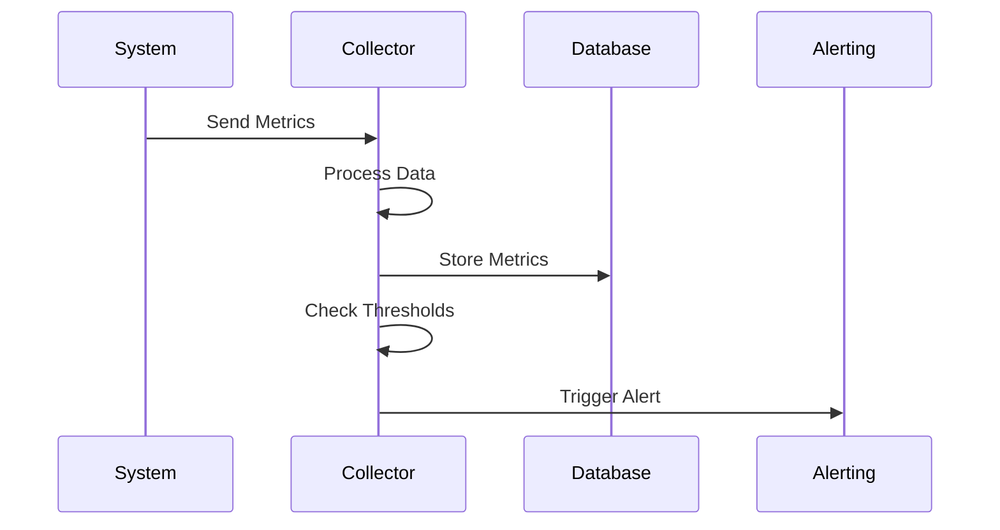
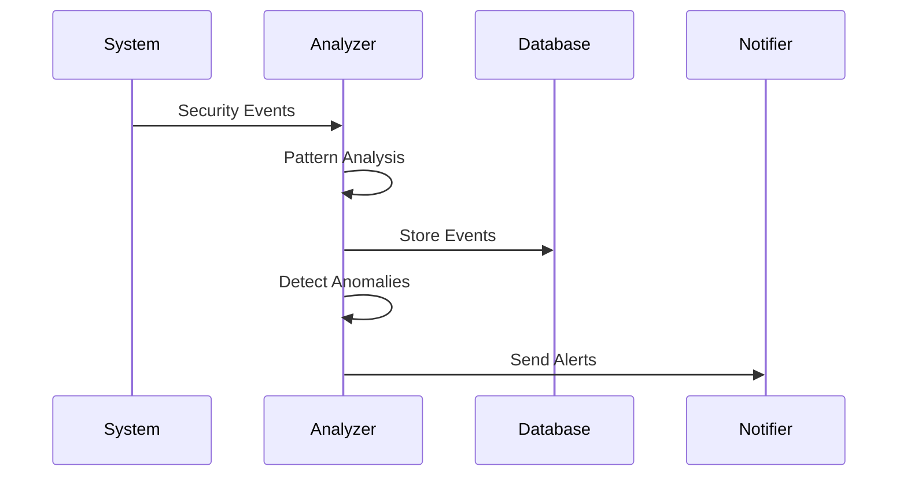
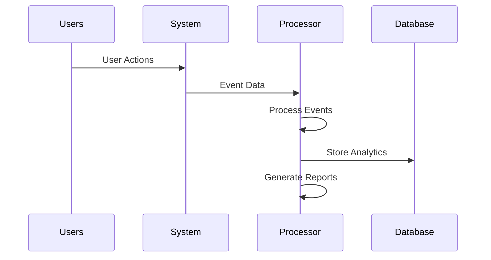

# Monitoring & Analytics

## System Monitoring

### Performance Metrics
- Response time
- Throughput
- Error rates
- Latency

### Resource Utilization
- CPU usage
- Memory usage
- Disk I/O
- Network traffic

### Error Tracking
- Error logs
- Stack traces
- Error patterns
- Error rates

### Health Checks
- Service status
- Dependencies
- Database health
- API health

## Security Monitoring

### Login Monitoring
- Success/Failure rates
- Geographic distribution
- Device types
- Time patterns

### Security Events
- Authentication failures
- Authorization violations
- Rate limit breaches
- Input validation failures

### Suspicious Activities
- Unusual patterns
- Brute force attempts
- Data access patterns
- API abuse

### Real-time Alerts
- Threshold alerts
- Anomaly detection
- Incident notifications
- Escalation rules

## Analytics Features

### Data Collection
- Log aggregation
- Metric collection
- Event tracking
- User tracking

### Data Processing
- Real-time processing
- Batch processing
- Data aggregation
- Data enrichment

### Visualization
- Dashboards
- Charts & graphs
- Heat maps
- Trend analysis

### Reporting
- Scheduled reports
- Custom reports
- Export options
- Report templates

## Use Cases

### 1. Performance Monitoring

### 2. Security Analysis

### 3. Usage Analytics

## Best Practices

### 1. Data Collection
- Structured logging
- Metric standardization
- Data sampling
- Data retention

### 2. Alert Management
- Alert prioritization
- Alert routing
- Alert correlation
- Alert fatigue prevention

### 3. Performance Impact
- Efficient collection
- Data compression
- Buffer management
- Resource limits

### 4. Data Analysis
- Trend analysis
- Pattern detection
- Predictive analytics
- Root cause analysis 