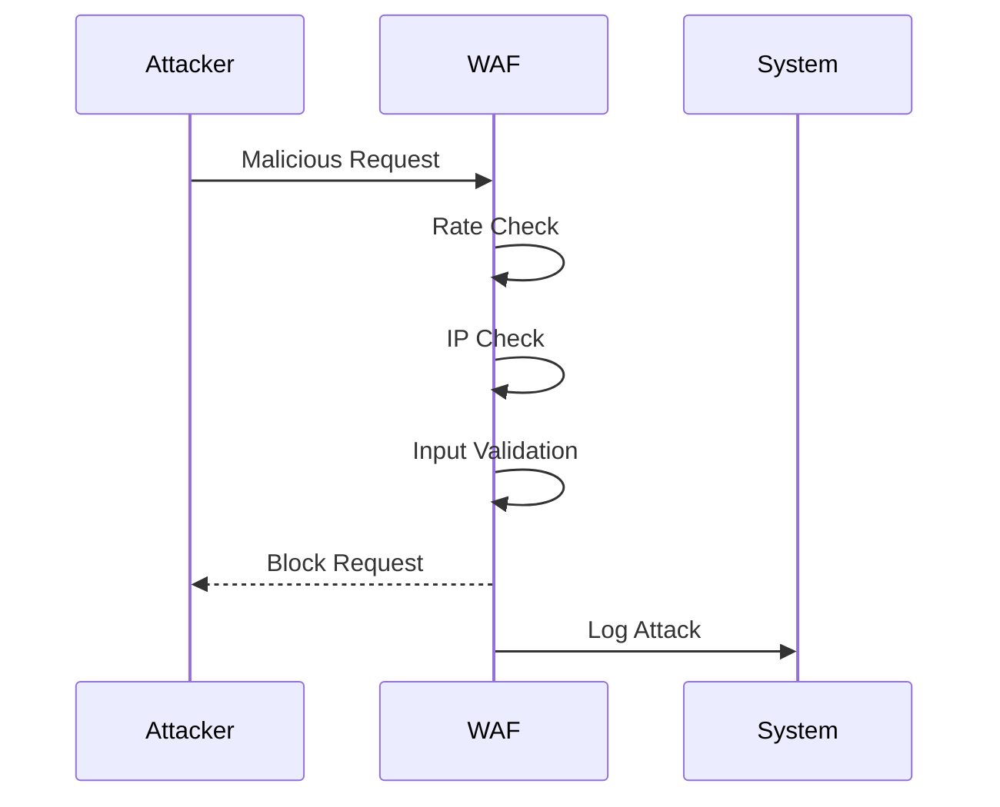
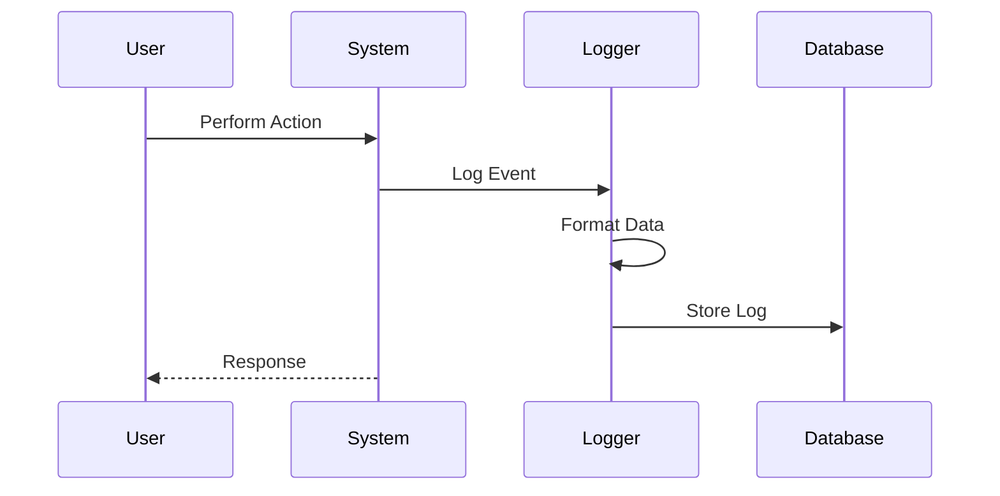
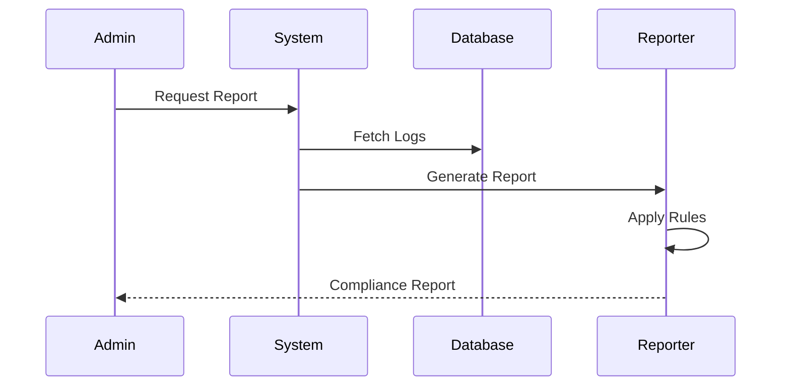

# Security Features

## Protection Mechanisms

### Rate Limiting
- Request rate control
- Burst protection
- IP-based limits
- User-based limits

### IP Filtering
- Blacklist/Whitelist
- Geo-blocking
- Proxy detection
- VPN detection

### CORS Protection
- Origin validation
- Method restrictions
- Header control
- Credential handling

### Input Validation
- Data sanitization
- Type checking
- Format validation
- Size limits

## Compliance & Audit

### Security Logging
- Access logs
- Error logs
- Security events
- System changes

### Audit Trails
- User actions
- System events
- Data changes
- Access attempts

### Compliance Reporting
- Activity reports
- Security metrics
- Compliance status
- Risk assessment

### Data Protection
- Encryption at rest
- Encryption in transit
- Key management
- Data masking

## Monitoring & Analytics

### System Monitoring
- Performance metrics
- Resource utilization
- Error tracking
- Health checks

### Security Monitoring
- Login attempts
- Security violations
- Suspicious activities
- Real-time alerts

## Use Cases

### 1. Attack Prevention

### 2. Audit Logging

### 3. Compliance Check

## Best Practices

### 1. Security Hardening
- Regular updates
- Security patches
- Configuration review
- Vulnerability scanning

### 2. Access Control
- Least privilege
- Role separation
- Access review
- Session management

### 3. Incident Response
- Alert mechanisms
- Response procedures
- Recovery plans
- Post-mortem analysis

### 4. Compliance Management
- Policy enforcement
- Regular audits
- Documentation
- Training programs 