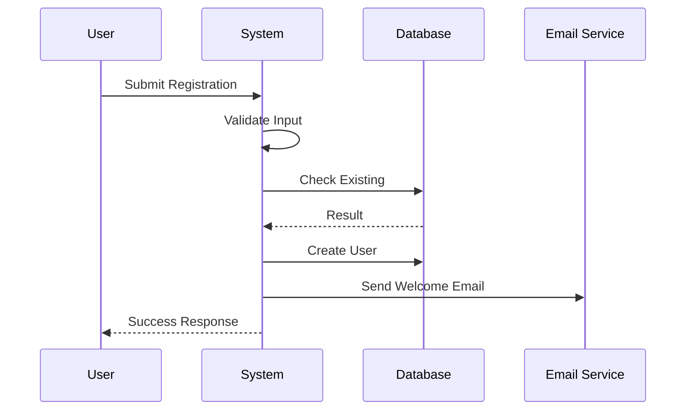
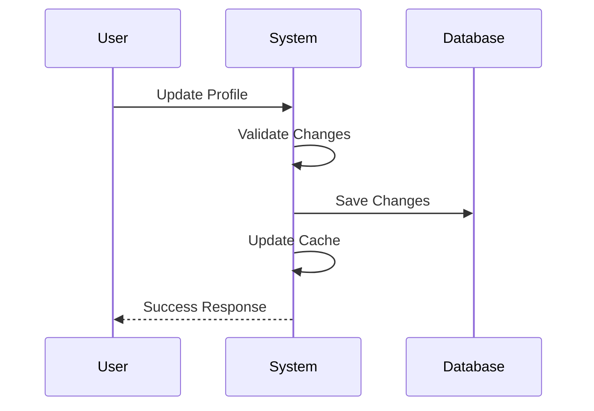
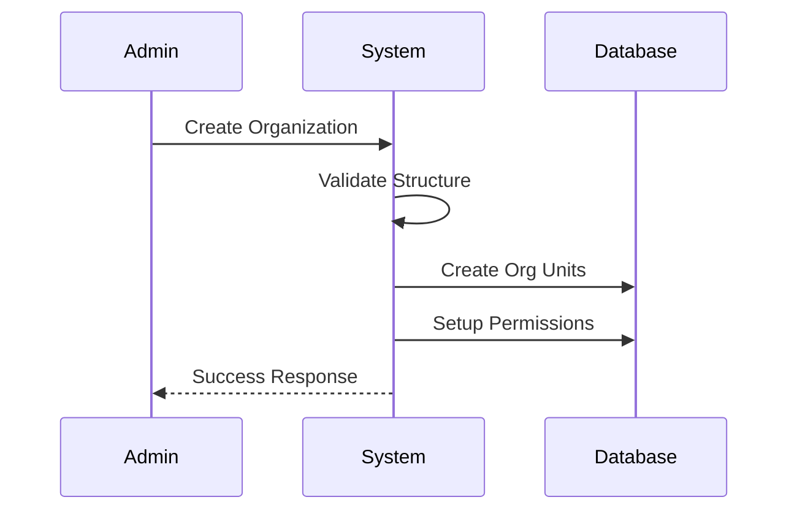

# User Management

## User Operations
### CRUD Operations
- Create new users
- Read user profiles
- Update user information
- Delete/Deactivate users

### Profile Management
- Profile information
- Contact details
- Preferences
- Settings

### Password Management
- Password reset
- Change password
- Password history
- Security questions

### Account Control
- Account status
- Account verification
- Account recovery
- Login history

## Organization Management

### Multi-tenant Support
- Tenant isolation
- Tenant configuration
- Resource sharing
- Cross-tenant access

### Organization Hierarchy
- Parent-child relationships
- Department structure
- Location management
- Business units

### Team Management
- Team creation
- Member assignment
- Team roles
- Team permissions

### User Grouping
- Dynamic groups
- Static groups
- Group policies
- Group hierarchy

## Use Cases

### 1. User Registration

### 2. Profile Update

### 3. Organization Setup

## Features

### 1. Data Management
- Data validation
- Data normalization
- Data enrichment
- Data cleanup

### 2. Integration
- External systems
- Identity providers
- Directory services
- SSO providers

### 3. Compliance
- Data protection
- Privacy controls
- Audit logging
- Regulatory compliance

### 4. Analytics
- User metrics
- Usage patterns
- Access statistics
- Behavior analysis 