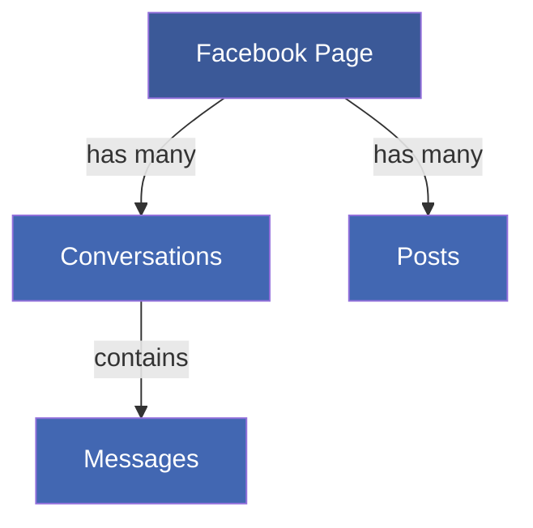
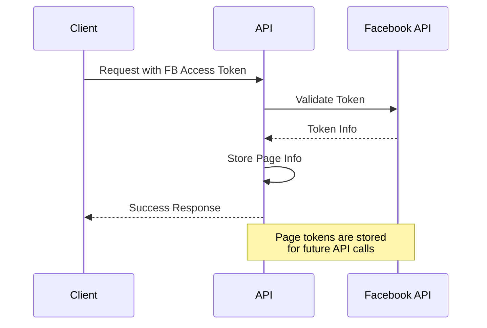

# Integrations - FolkForm Authentication Backend

## Facebook Integration

### 1. Components


### 2. Data Models

#### Facebook Page
```go
type FbPage struct {
    ID              ObjectID
    PageName        string
    PageUsername    string
    PageId          string    // unique
    IsSync          bool
    AccessToken     string
    PageAccessToken string
    PanCakeData     map[string]interface{}
    CreatedAt       int64
    UpdatedAt       int64
}
```

#### Facebook Conversation
```go
type FbConversation struct {
    ID               ObjectID
    PageId           string    // indexed
    PageUsername     string    // indexed
    ConversationId   string    // unique, indexed
    CustomerId       string    // indexed
    PanCakeData      map[string]interface{}
    PanCakeUpdatedAt int64
    CreatedAt        int64
    UpdatedAt        int64
}
```

### 3. API Endpoints

#### Facebook Pages
```
GET    /api/v1/pages           # List all pages
GET    /api/v1/pages/:id       # Get page by ID
PUT    /api/v1/pages/token     # Update page access token
POST   /api/v1/pages           # Add new page
DELETE /api/v1/pages/:id       # Remove page
```

#### Facebook Conversations
```
GET    /api/v1/conversations/newest    # Get newest conversations
GET    /api/v1/conversations/:id       # Get conversation by ID
POST   /api/v1/conversations          # Create conversation
DELETE /api/v1/conversations/:id      # Delete conversation
```

### 4. Authentication Flow


### 5. Data Synchronization

#### Page Sync Process
1. Lưu trữ page access token
2. Đồng bộ thông tin cơ bản của page
3. Theo dõi trạng thái đồng bộ qua `IsSync`
4. Lưu trữ dữ liệu phụ trong `PanCakeData`

#### Conversation Sync
1. Lấy conversations từ Facebook API
2. Lưu trữ trong database với index
3. Cập nhật `PanCakeUpdatedAt` để theo dõi
4. Lưu trữ metadata trong `PanCakeData`

### 6. Security Considerations

#### Token Management
- Access tokens được lưu trữ an toàn
- Page tokens được quản lý riêng biệt
- Hỗ trợ cập nhật token khi hết hạn

#### Permission Requirements
- Yêu cầu "Facebook.Read" cho các operation đọc
- Yêu cầu "Facebook.Update" cho các operation cập nhật
- Yêu cầu "Facebook.Delete" cho các operation xóa

### 7. Implementation Guidelines

#### Adding New Page
1. Validate Facebook access token
2. Lấy page information từ Facebook API
3. Tạo record trong database
4. Bắt đầu sync process

#### Managing Conversations
1. Sử dụng page token để fetch conversations
2. Lưu trữ với proper indexing
3. Cập nhật regular để dữ liệu mới nhất

### 8. Error Handling

#### Common Scenarios
1. Invalid/expired tokens
2. Rate limiting từ Facebook API
3. Sync failures
4. Permission issues

#### Response Format
```json
{
    "success": false,
    "error": {
        "code": "FB_TOKEN_EXPIRED",
        "message": "Facebook access token has expired",
        "details": {}
    }
}
```

### 9. Monitoring & Logging

#### Key Metrics
- Token validity status
- Sync success rate
- API call latency
- Error frequency

#### Log Events
- Token updates
- Sync operations
- Permission changes
- Error occurrences 