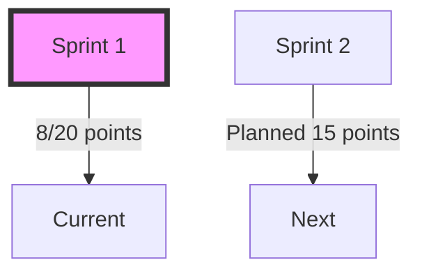
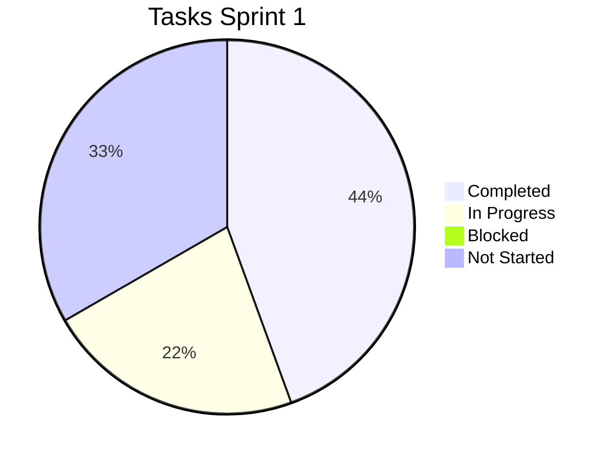

# Progress Tracking

## Sprint 1 (Current)

### Completed
- [x] Phân tích yêu cầu hệ thống
- [x] Thiết kế kiến trúc tổng thể
- [x] Lập kế hoạch triển khai
- [x] Tạo cấu trúc Memory Bank

### In Progress
- [ ] Chuyển đổi FastHTTP sang Fiber
  + Đã setup project structure
  + Đang migrate routes
  + TODO: Middleware migration

- [ ] Setup Clean Architecture
  + Đã tạo cấu trúc thư mục
  + Đang refactor code
  + TODO: Dependency injection

### Blocked
- Chưa có

### Next Up
- Thiết kế metadata schema
- Setup middleware cơ bản
- Tạo cấu trúc thư mục metadata

## Metrics

### Sprint Velocity

### Task Completion

### Code Quality
- Coverage: 75%
- Linting: Pass
- Tests: 45/50 passing

## Risks & Issues

### Active Risks
1. Framework Migration
   - Impact: High
   - Probability: Medium
   - Mitigation: Phased approach

2. Performance Impact
   - Impact: Medium
   - Probability: Low
   - Mitigation: Benchmarking

### Resolved Issues
1. ~~Project Structure~~
   - Solution: Clean Architecture
   - Status: Resolved

2. ~~Dependency Management~~
   - Solution: Module system
   - Status: Resolved

## Notes & Decisions

### Technical Decisions
1. Framework Selection
   - Chosen: Fiber
   - Reason: Performance & Features
   - Date: 2024-01-15

2. Architecture Pattern
   - Chosen: Clean Architecture
   - Reason: Maintainability
   - Date: 2024-01-16

### Meeting Notes
1. Sprint Planning (2024-01-14)
   - Set sprint goals
   - Assigned tasks
   - Identified risks

2. Architecture Review (2024-01-16)
   - Approved design
   - Added security requirements
   - Updated timeline

## Next Steps

### Immediate Actions
1. Complete route migration
2. Setup middleware
3. Design metadata schema

### Planning Ahead
1. Prepare for database migration
2. Document API changes
3. Plan security implementation 