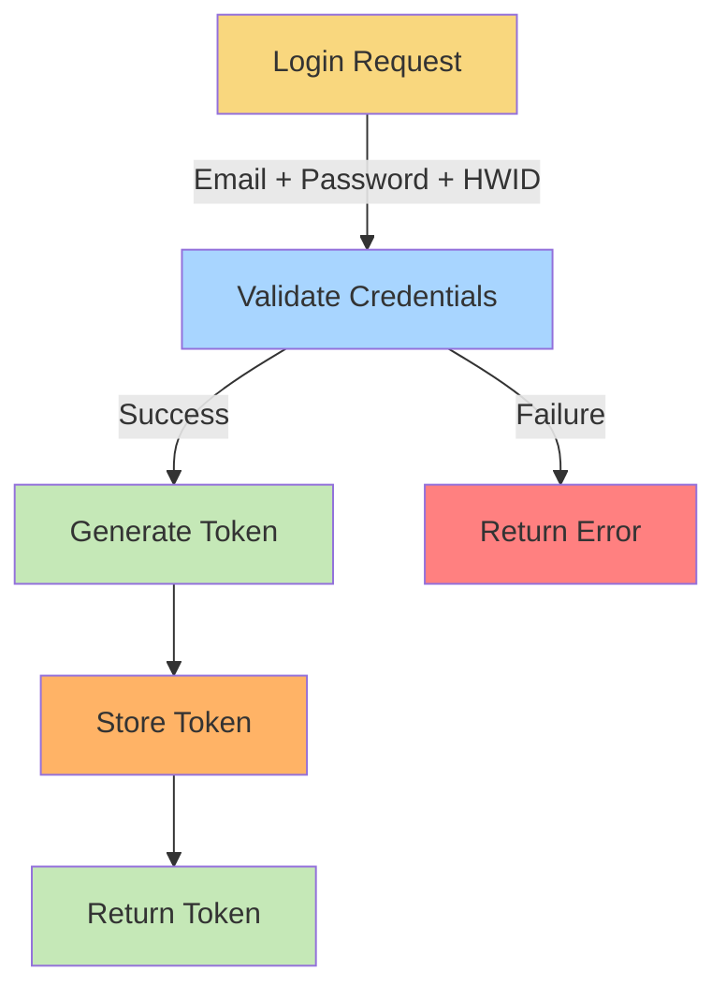
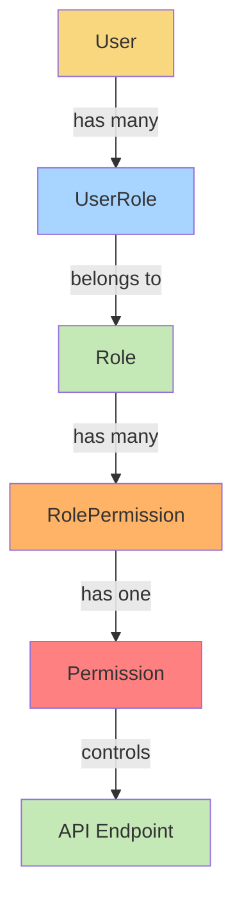
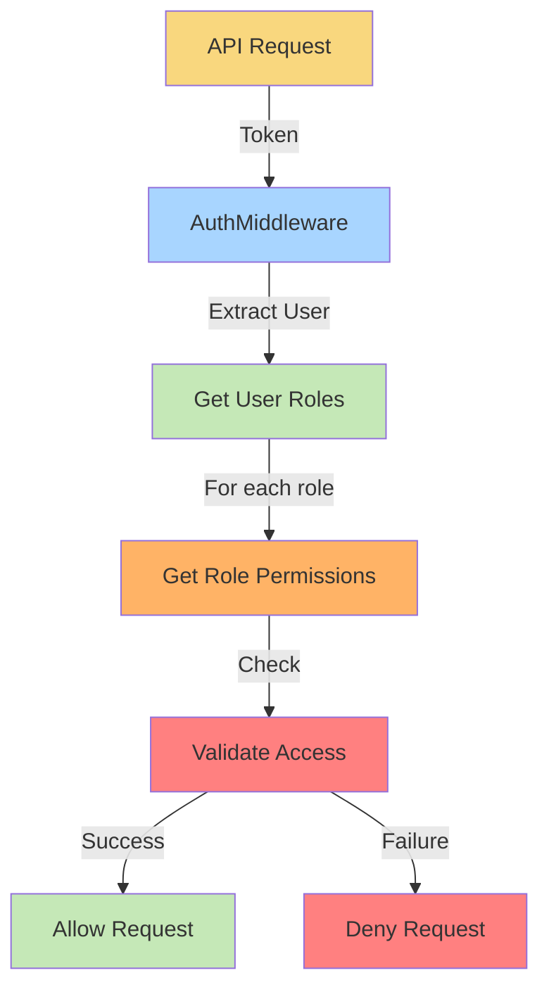

# System Patterns - FolkForm Authentication Backend

## Authentication & Authorization Pattern

### 1. User Authentication Flow


### 2. Permission Hierarchy


## Data Models

### 1. User Model
```go
type User struct {
    ID        ObjectID
    Name      string
    Email     string    // unique
    Password  string    // hashed
    Salt      string
    Token     string    // current token
    Tokens    []Token   // all valid tokens
    IsBlock   bool
    BlockNote string
    CreatedAt int64
    UpdatedAt int64
}
```

### 2. Permission System
#### Permission Model
```go
type Permission struct {
    ID        ObjectID
    Name      string    // unique
    Describe  string
    Category  string    // grouping
    Group     string    // sub-grouping
    CreatedAt int64
    UpdatedAt int64
}
```

#### Role Model
```go
type Role struct {
    ID        ObjectID
    Name      string    // unique
    Describe  string
    CreatedAt int64
    UpdatedAt int64
}
```

#### RolePermission Model
```go
type RolePermission struct {
    ID              ObjectID
    RoleID          ObjectID
    PermissionID    ObjectID
    Scope           byte     // 0: All, 1: Assign
    CreatedByRoleID ObjectID
    CreatedByUserID ObjectID
    CreatedAt       int64
    UpdatedAt       int64
}
```

## API Structure

### 1. Base Routes
- API Base: `/api`
- Version 1: `/api/v1`

### 2. Authentication Routes
```
POST /api/v1/users/login       # Login with email/password
POST /api/v1/users/register    # New user registration
POST /api/v1/users/logout      # Logout (requires auth)
GET  /api/v1/users/profile     # Get user profile (requires auth)
PUT  /api/v1/users/profile     # Update profile (requires auth)
```

### 3. CRUD Pattern
Mỗi resource có các endpoint chuẩn:
```
POST   /:resource          # Create one
POST   /:resource/batch    # Create many
GET    /:resource          # Find all
GET    /:resource/:id      # Find by ID
PUT    /:resource/:id      # Update by ID
DELETE /:resource/:id      # Delete by ID
```

## Security Patterns

### 1. Multi-Device Authentication
- Mỗi device được định danh bằng HWID
- Mỗi device có token riêng
- Tokens được lưu trong User.Tokens array

### 2. Permission Checking


## Implementation Guidelines

### 1. Creating New Endpoints
1. Định nghĩa route trong `routes.go`
2. Implement handler function
3. Thêm permission check với middleware
4. Thêm validation cho input data

### 2. Adding New Permissions
1. Thêm permission vào database
2. Gán permission cho role phù hợp
3. Update middleware check

### 3. User Role Management
1. Tạo role mới trong database
2. Gán permissions cho role
3. Assign role cho user

## Testing Strategy

### 1. Unit Tests
- Test các model method
- Test các validation rule
- Test các helper function

### 2. Integration Tests
- Test authentication flow
- Test permission checking
- Test CRUD operations

### 3. Security Tests
- Test token validation
- Test permission boundaries
- Test input validation
- Test error handling 